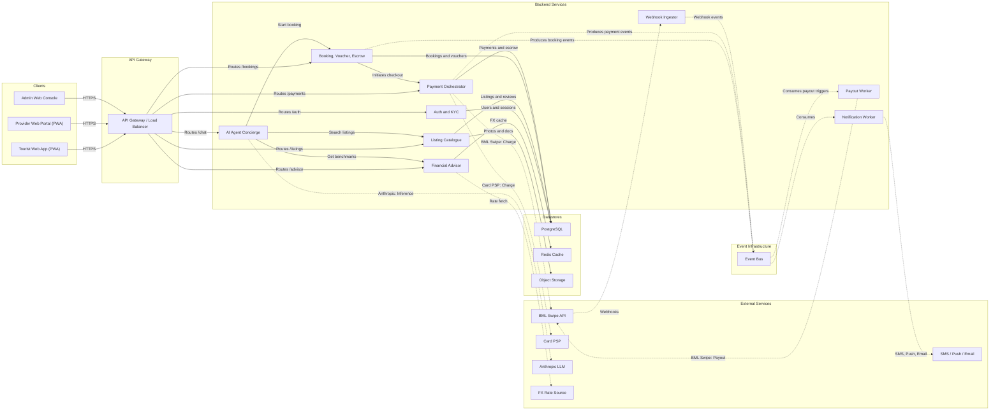

# AfterArrival — System Architecture v0.1

**For:** Lead developer review
**Last updated:** 2026-05-20
**Companion to:** [PRD.md](./PRD.md)

This is a high-level system-architecture diagram intended for the lead developer
to validate the moving parts before we commit to a v1 build plan. Every box is
something we'd own, configure, or pay for. Everything *not* shown is deliberately
out (accommodation, transfers, transport — see PRD §18.1).

The diagram is Mermaid; GitHub renders it natively, and you can paste the source
into <https://mermaid.live> for a larger zoomable view, or export to FigJam later.

## Diagram

## Walkthrough

### Clients (3)

- **Tourist Web App (PWA)** — responsive web application, mobile-first.
  Tourists access via QR code at the guesthouse / jetty and install to home
  screen as a PWA for the duration of the trip. All consumer-facing journeys:
  discovery, booking, payment, chat with the AI concierge, receipts. No native
  iOS/Android apps in v1.
- **Provider Web Portal (PWA)** — same responsive web app, served at a
  provider subdomain. Mobile-first for phone use, but functional on desktop.
  Dhivehi + English from day 1. Booking inbox, voucher scanner (browser
  camera + WebRTC), earnings + analytics, KYC.
- **Admin Web Console** — internal-only desktop-first web app. Verification
  queue, dispute resolution, listing moderation, reporting, payout overrides.

### API Gateway (1)

A single ingress: load balancer + TLS termination + JWT verification + rate
limiting + WAF. Routes by path prefix to the relevant service. No business
logic in the gateway.

### Backend services (9)

| Service | Responsibility |
|---|---|
| **Auth and KYC** | Phone/email auth, OAuth client management, NID + business-reg verification flow, session issuance, role/scope enforcement. |
| **Listing Catalogue** | CRUD for provider listings, photo upload references, availability calendars, search and filter (geo, category, price, dietary). |
| **Booking, Voucher, Escrow** | Booking lifecycle (created → confirmed → fulfilled → released/refunded), signed QR voucher generation, escrow state, reviews, disputes. |
| **Payment Orchestrator** | Checkout API. Decides Swipe vs. card per payer; calls the right rail; holds funds; processes refunds via the platform ledger (Swipe has no refund endpoint, so refund logic lives here — see PRD §9.5). |
| **Payout Worker** | Async consumer. Batches release-eligible bookings into Swipe `POST /api/v1/payouts` calls; emits payout-settled events. |
| **Webhook Ingestor** | Public endpoint for Swipe webhook delivery. Verifies HMAC signature, deduplicates, enqueues to the event bus. Isolated from core services so webhook traffic can't impact tourist-facing latency. |
| **Notification Worker** | Async consumer. Fans booking/payment/dispute events out to SMS/push/email providers. |
| **AI Agent Concierge** | Chat orchestrator. Holds per-trip context, calls the LLM, executes tool calls (`search_listings`, `start_booking`, `get_benchmark_price`, etc.), enforces refusals + escalation. PRD §11. |
| **Financial Advisor** | FX-rate refresh, USD↔MVR conversion, TGST itemization helpers, budget tracker, benchmark aggregates. PRD §10. |

### Datastores (3)

- **PostgreSQL** — primary system of record for users, KYC, listings, bookings, payments, escrow ledger, reviews, disputes.
- **Redis** — session cache, FX-rate cache, hot listing-search cache.
- **Object Storage** — listing photos, KYC documents, voucher PDFs. S3-compatible.

### External services (5)

- **BML Swipe API** — domestic charge rail + provider payouts ([repo](https://github.com/BML-Digital/swipe-merchants-dev)). Two integration touches: outbound (charge, payout) and inbound (webhooks → ingestor).
- **Card PSP** — international tourist payments. **[DECIDE]** which acquirer; Stripe doesn't operate in Maldives, candidates are 2Checkout, Adyen reseller, or local acquirer.
- **Anthropic LLM** — backs the AI concierge. Haiku/Sonnet/Opus mix with prompt caching, per PRD §11.5.
- **FX Rate Source** — Central Bank of Maldives reference rate preferred; commercial bank rates as fallback.
- **SMS / Push / Email** — transactional messaging providers (Dhiraagu/Ooredoo SMS, FCM/APNs push, transactional email).

### Event infrastructure (1)

- **Event Bus** — booking events, payment events, validated webhook events fan
  out to notification + payout workers. v1 implementation can be a single
  managed queue (SQS, Pub/Sub) or a lightweight broker; the architectural
  contract is "everything async goes through the bus."

## Key flows summarized

1. **Tourist books a service**: app → gateway → bookingService → paymentService → BML Swipe / Card PSP. Funds held in escrow. Booking events published.
2. **Payment confirmed via webhook**: Swipe → webhookIngestor → eventBus → notificationWorker (push to tourist + provider) and bookingService (status update).
3. **Service delivered**: provider app scans voucher (offline-safe, signed). bookingService marks fulfilled. Cooling-off window elapses. Payout-eligible event published.
4. **Provider gets paid**: payoutWorker batches eligible bookings → Swipe payout → events fan out (provider notified, ledger updated).
5. **Tourist asks the concierge**: app → gateway → aiAgentService → Anthropic LLM (RAG over listings + KB) → tool calls into listingService / financialAdvisor / bookingService → streamed response back to app.

## Out of the diagram (deliberate)

- **Accommodation, transfers, transport** — out of product scope (PRD §18.1).
- **Vector DB for AI RAG** — assumed to be `pgvector` inside PostgreSQL for v1 to avoid a new datastore. If retrieval quality demands a dedicated vector store later, add it as a separate `datastore` node.
- **Observability stack** (logs, metrics, traces) — every service emits to a managed observability backend; omitted to keep the diagram focused on request flow.
- **CI/CD, infra-as-code, secrets management** — operational concerns, not request-flow concerns.
- **CDN** — assumed in front of object storage for image serving; not a request-path node for backend services.
- **Admin Service** as a distinct backend — admin actions go through the same gateway + services with elevated roles; no separate service in v1.

## Open architecture decisions

1. **API gateway implementation** — managed (Cloudflare, AWS API Gateway) vs. self-hosted (Kong, Envoy). Latency to South Asia matters; PRD §13 currently targets AWS Mumbai or Singapore.
2. **Event bus choice** — managed (SQS, Pub/Sub) vs. self-hosted (NATS, RabbitMQ). Operational simplicity wins for v1 unless throughput projections say otherwise.
3. **Service boundary for Financial Advisor + AI Agent** — currently two services; if benchmark logic ends up almost entirely consumed by the agent, merging may reduce hops. Defer until after v1 traffic data.
4. **Webhook ingestor on its own vs. inside Payment Orchestrator** — separate is cleaner (isolation, scaling) but adds an extra deploy. Lead-dev call.
5. **Card PSP integration shape** — direct API vs. hosted checkout redirect. Affects whether `paymentService` calls the PSP synchronously or whether the tourist app embeds a PSP SDK.
